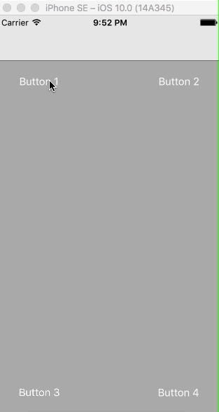

# DKDropDownMenu

If your boss wants you to add a drop down menu to your iOS app and you are tired of empty talks about guidelines and absence of such a control like drop down menu in UIKit - just use DKDropDownMenu.

More configuration options are added in future. Hopefully. For now you can use shadowView property of DKDropDownViewController to configure shadow's layer if you don't like the default one or subclass DKDropDownViewController to provide your own cell's configurations by overriding UITableViewDataSource protocol methods in case of emergency.

[](https://travis-ci.org/Dmytro Kovryhin/DKDropDownMenu)
[](http://cocoapods.org/pods/DKDropDownMenu)
[](http://cocoapods.org/pods/DKDropDownMenu)
[](http://cocoapods.org/pods/DKDropDownMenu)

## Example

To run the example project, clone the repo, and run `pod install` from the Example directory first.



## Installation

DKDropDownMenu is available through [CocoaPods](http://cocoapods.org). To install
it, simply add the following line to your Podfile:

```ruby
pod "DKDropDownMenu"
```

## Author

Dmytro Kovryhin, agnostic.88@yandex.ua

## License

DKDropDownMenu is available under the MIT license. See the LICENSE file for more info.
